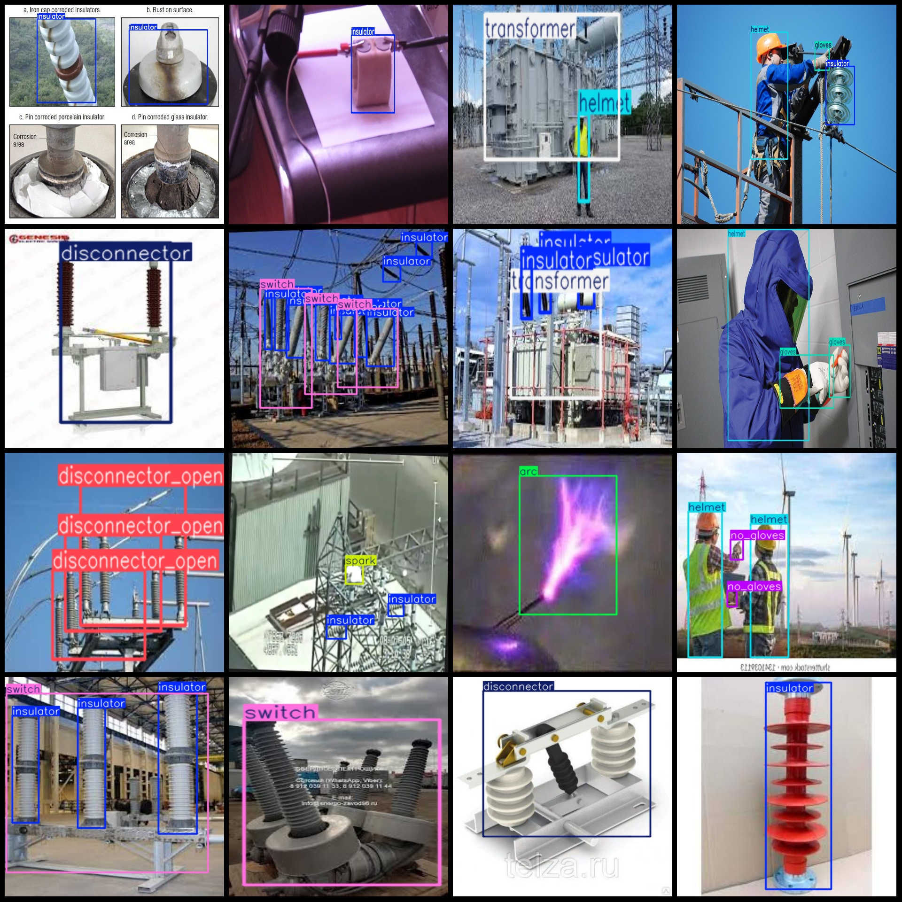
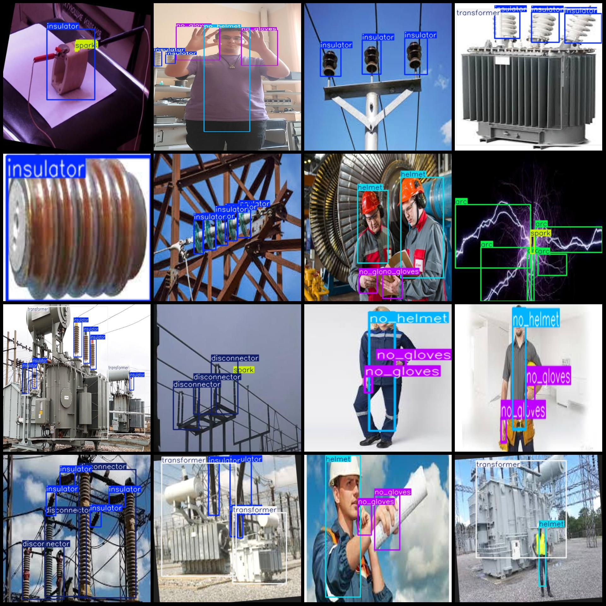

# Power Scene Electric Arc Interrupter Glove Helmet Insulator Spark and Transformer Inspection Dataset VOC+YOLO Format 4593 Images, 11 Categories

This dataset consists of 4593 images in the format of VOC+YOLO, covering 11 categories in the power scene. It includes images of electric arc isolation switches, gloves, helmets, insulators, sparks, transformers, and other related equipment. The dataset is mainly used for training deep learning models to detect and classify these devices and components in real-time.

Pay attention to the dataset, half of it is enhanced images, mainly rotation and cropping.
Dataset format: Pascal VOC format+YOLO format(without split path in txtfile, only include jpgimage and corresponding VOC formatxmlfile and yolo formattxtfile)
number of images: 4593  
annotation count: 4593  
annotation count: 4593  
annotationnumber of classes: 11  
["arc", "disconnector", "disconnector_open", "gloves", "helmet", "insulator", "no_gloves", "no_helmet", "spark", "switch", "transformer"]
Number of boxes labeled in each category:
The arc length in the box is 615.
Number of boxes = 966
Disconnector_open (separator open status) frame = 698
The frame count for gloves (insulating gloves) is 905.
Helmet: 1592
Insulator: 6599
No Gloves: 1296
No Helmet: 515
Spark: 1747
Switch: 870
Transformer (transformer) frame count = 453
Total frames: 16,256
Image resolution: Multi-resolution images, such as 194x259, 1025x792, etc.
Using annotating tool: labelImg
Annotation rules: Drawing a rectangle box around the class
Important notes: The dataset is not divided into training, validation, and test sets; you need to divide them yourself.
Special statement: This dataset does not guarantee the accuracy of the trained model or weight file.
Image preview:
## Images

Here is a pay link on Stripe ( https://buy.stripe.com/3cs8yP7sY87d0vu9AB ). Please contact me lonlonago@foxmail.com after funding $89, and I will send you a complete data files , thank you!

